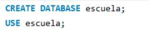
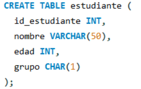
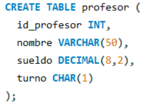
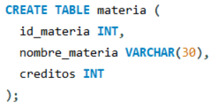
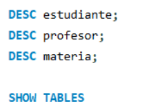

# Evidencias de la Práctica

## Paso 1: Creación de la Base de Datos
Primero creé la base de datos `escuela` en MySQL Workbench.

## Paso 2: Creación de las Tablas
Ejecuté el código para generar las tres tablas solicitadas con sus respectivas columnas y tipos de datos (`INT`, `VARCHAR`, `CHAR` y `DECIMAL`).

### Tabla Estudiante

### Tabla Profesor

### Tabla Materia

## Paso 3: Comprobación de Estructuras
Finalmente ejecuté el comando `DESC` para verificar la estructura de las tablas creadas y confirmar que los campos y tipos de datos se configuraron correctamente.

